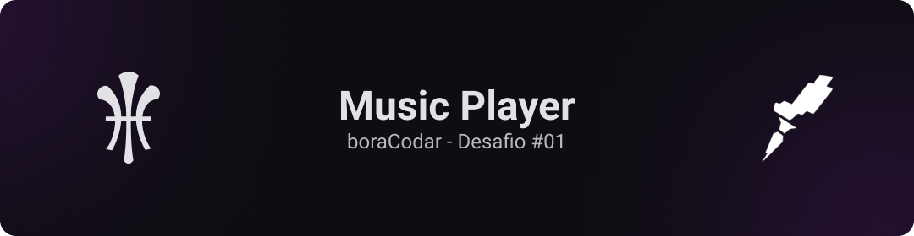

<h1 align='center'>Music Player - #boraCodar</h1>

<p> Esse projeto foi desenvolvido durante o primeiro desafio semanal da Rocketseat, chamado #boraCodar. O projeto foi desenvolvido em <b>HTML5, CSS3.</b></p>

- [Acessar Desafio](https://boracodar.dev)

## 🛠 - Tecnologias

- HTML5
- CSS3
- Grid e Flexbox.

<h3>🎨 - Protótipo</h3>

Acesse o protótipo disponibilizado pela Rocketseat clicando no botão abaixo:

<a href="https://www.figma.com/file/aUPz0jeV4vtvVcyIASj0RA/%23boraCodar---Desafio-1?node-id=1128%3A22&t=1zXSyQs8rmFfMeG4-1
"></a>

<h3>🔗 - Deploy</h3>

Acesse o projeto em produção clicando no botão abaixo:

<a href="" target='_blank'></a>

<h3> ✔ - Requisitos</h3>

Para rodar o projeto na sua máquina é necessário:

- Editor de Códigos(como VS Code)
- Git
- Navegador

<h3> 🖥 - Rodando Localmente</h3>

Primeiro clone o projeto na sua máquina

```bash
git clone https://github.com/gabrielgxrcia/boraCodar#1.git
cd boraCodar#1
```

## 👤 - Autor

<table>
  <tr>
    <td align="center"><a href="https://github.com/gabrielgxrcia"><br /><sub><b>Gabriel Garcia</b></sub></a><br /><br /><a href="https://www.linkedin.com/in/gabrielgarciagrazeffi/"></a>⠀<a href="mailto:gabrielgrazeffi12@gmail.com"></a>
